# AWS VPC Networking Project

This project demonstrates the creation of a custom AWS Virtual Private Cloud (VPC) with public networking components, including subnets across multiple Availability Zones, an Internet Gateway, routing configuration, EC2 instances, and security controls.

The goal of this project is to understand **how traffic flows in AWS networking**, not just to deploy resources. All components were validated from both the AWS Console and the operating system level using SSH and networking commands.

### Step 1: VPC Creation
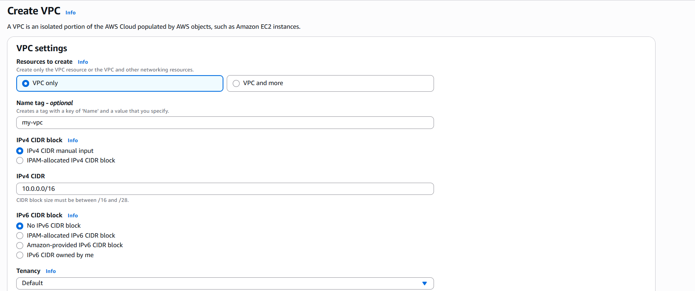

Explanation (Why this step exists)

A VPC provides an isolated networking boundary in AWS.
All subnets, routing tables, and instances must exist inside a VPC.

For this project, a custom VPC was created using the CIDR block 10.0.0.0/16 to allow sufficient IP space for multiple subnets.

### Step 2: Public Subnet Creation
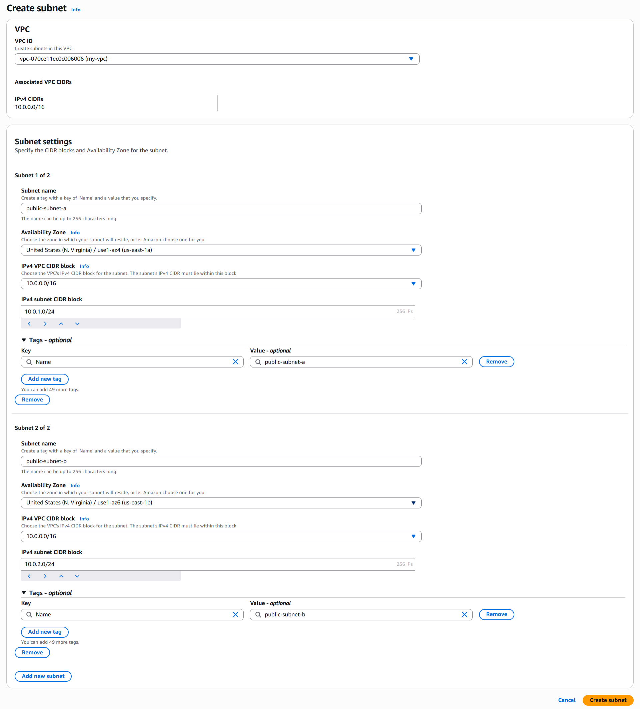

### Subnet List Verification
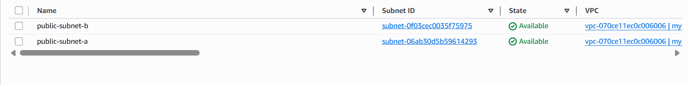

Explanation

Two public subnets were created within the VPC to demonstrate subnetting and Availability Zone separation.

public-subnet-a → 10.0.1.0/24

public-subnet-b → 10.0.2.0/24

Each subnet resides in a different Availability Zone to reflect basic high-availability design principles.

### Step 3: Internet Gateway Creation
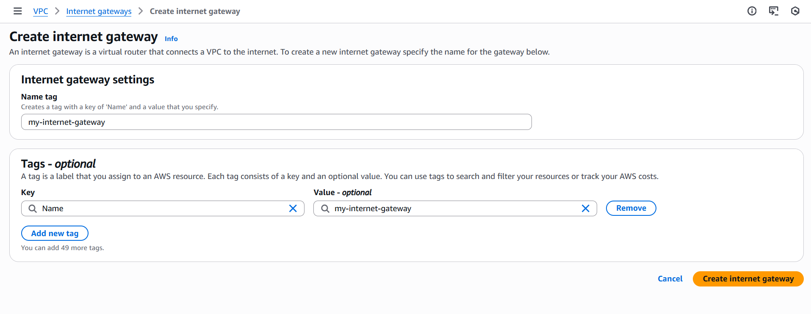

### Internet Gateway Attached to VPC
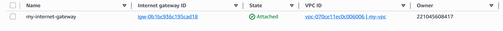

Explanation

An Internet Gateway (IGW) enables communication between resources in the VPC and the public internet.

Without an IGW, instances cannot send or receive traffic from outside the VPC.

### Step 4: Public Route Table Creation
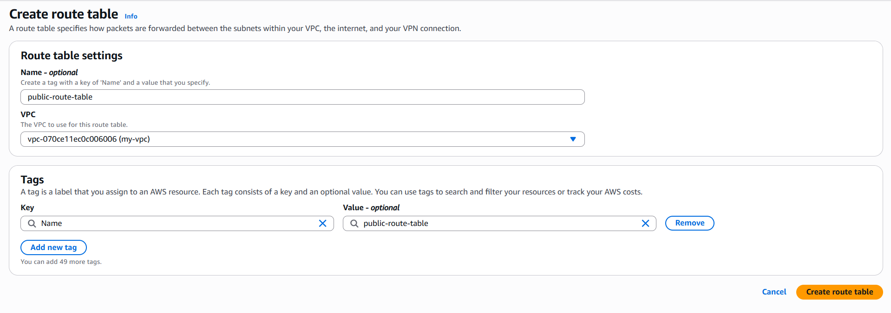

### Adding Internet Gateway Route
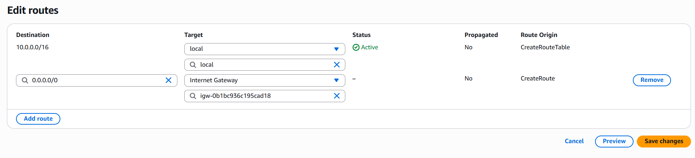

Explanation

A route table determines how traffic is routed from subnets.

A public route table was created with a default route:

0.0.0.0/0 → Internet Gateway

This route allows outbound internet access for instances in associated subnets.

### Step 5: Subnet Association
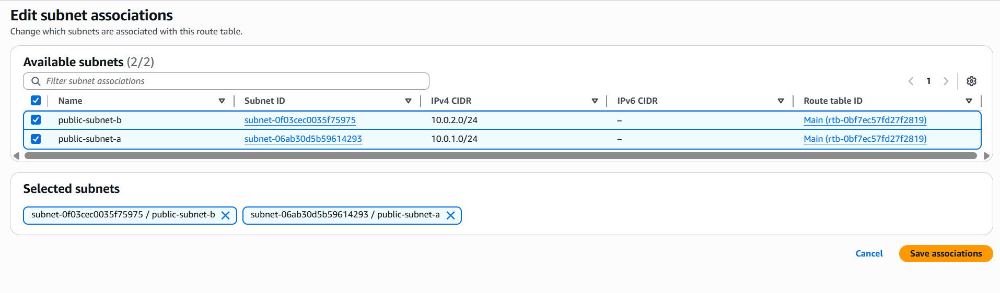

Explanation

For a subnet to be considered public, it must be associated with a route table that has a route to the Internet Gateway.

Both public subnets were explicitly associated with the public route table.

### Step 6: Security Group Creation
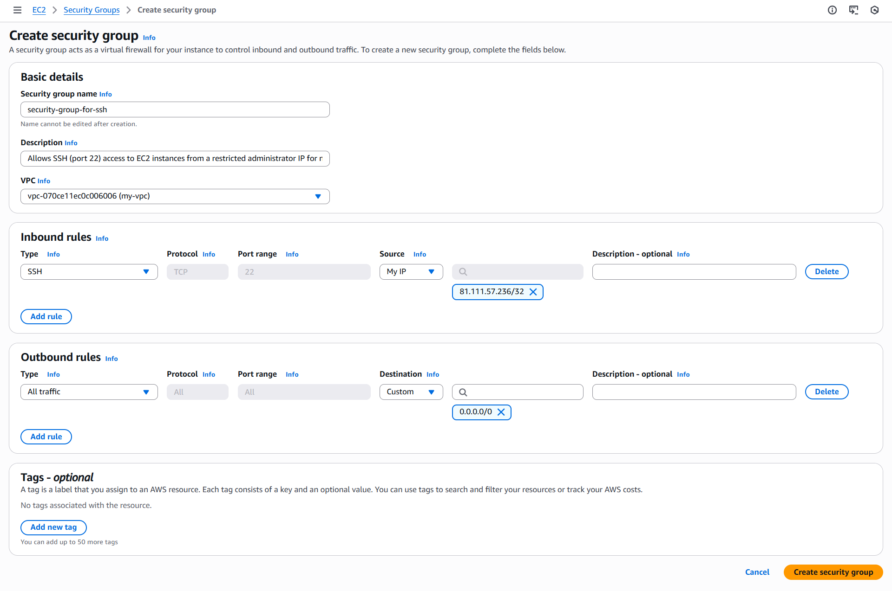

### SSH Inbound Rule
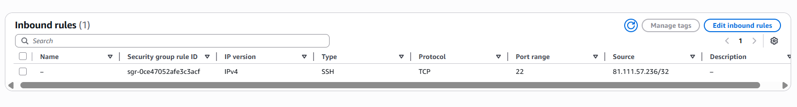

Explanation

A security group was created to control inbound and outbound traffic to EC2 instances.

Inbound: SSH (TCP port 22) from a single trusted IP (/32)

Outbound: All traffic allowed (default)

This follows the principle of least privilege.

### Step 7: EC2 Instance Launch

### EC2 Instances Running
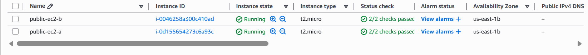

Explanation

Two EC2 instances were launched:

public-ec2-a in public-subnet-a

public-ec2-b in public-subnet-b

Both instances:

Use the same key pair

Use the same security group

Have public IPv4 addresses enabled

### Step 8: Network Validation from EC2
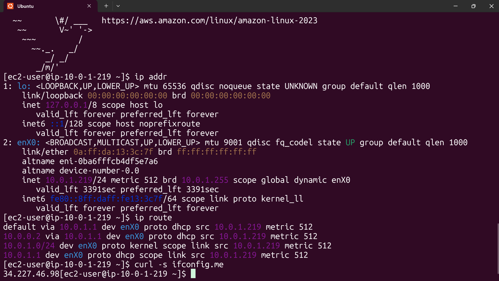

Explanation

SSH was used from an Ubuntu (WSL) environment to validate:

Subnet placement

Routing configuration

Internet connectivity

Commands executed on each instance:

ip addr
ip route
curl -s ifconfig.me

## Key Learnings
- A subnet is only public when routing, IP assignment, and security controls are all configured correctly
- EC2 instances do not receive public IPs unless explicitly enabled
- Subnet placement must be verified during instance launch
- OS-level validation provides stronger confidence than console checks alone

## Cleanup
All EC2 instances and networking resources were terminated after validation to prevent charges.

